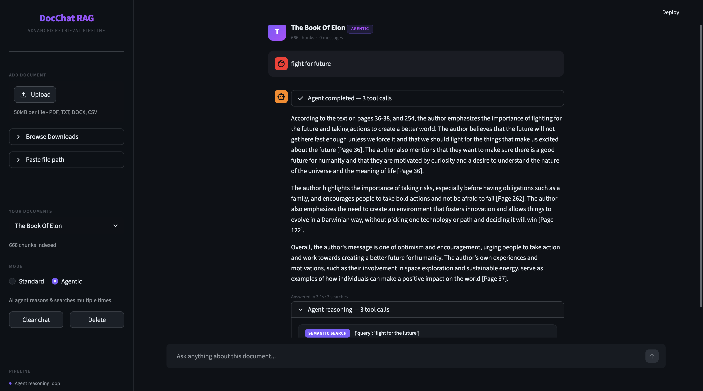

# DocChat RAG

> Chat with any document using an advanced RAG pipeline — hybrid retrieval, cross-encoder reranking, and an agentic multi-search mode.



---

## What it does

Upload a **PDF, TXT, DOCX, or CSV** and ask questions about it in natural language. Two modes:

| Mode | How it works |
|---|---|
| **Standard** | HyDE query expansion → multi-query generation → BM25 + vector hybrid search → reciprocal rank fusion → cross-encoder reranking → LLM answer with hallucination verification |
| **Agentic** | LLM agent plans, breaks the question into sub-queries, calls search tools multiple times with different strategies, then synthesises a grounded answer with page citations |

---

## Features

- **HyDE** — generates a hypothetical answer, embeds it for better semantic matching
- **Hybrid retrieval** — BM25 keyword search + vector semantic search combined via Reciprocal Rank Fusion
- **Cross-encoder reranking** — `ms-marco-MiniLM-L-6-v2` rescores every chunk for precision
- **Multi-query expansion** — LLM generates query variations to maximise recall
- **Agentic mode** — tool-calling agent that adapts its search strategy per question
- **Hallucination verification** — answer is checked against retrieved sources
- **Multi-format support** — PDF, TXT, DOCX, CSV
- **Streaming answers** — Standard mode streams token by token
- **Page citations** — every claim is cited with `[Page N]`

---

## Tech stack

- **LLM** — Groq (`llama-3.3-70b-versatile`)
- **Embeddings** — `sentence-transformers/all-mpnet-base-v2` (local)
- **Reranker** — `cross-encoder/ms-marco-MiniLM-L-6-v2` (local)
- **Vector store** — ChromaDB (local, per-document)
- **Keyword search** — BM25 via `rank-bm25`
- **UI** — Streamlit
- **Orchestration** — LangChain

---

## Setup

### Prerequisites
- Python 3.13
- A [Groq API key](https://console.groq.com/keys)
- A [Google AI Studio API key](https://aistudio.google.com/app/apikey)

### Install

```bash
git clone https://github.com/YOUR_USERNAME/docchat-rag.git
cd docchat-rag

python3.13 -m venv venv
source venv/bin/activate          # Windows: venv\Scripts\activate

pip install -r requirements.txt
```

### Configure

```bash
cp .env.example .env
# Open .env and add your API keys
```

`.env` contents:
```
GROQ_API_KEY=your_groq_key_here
GOOGLE_API_KEY=your_google_key_here
```

### Run

```bash
source venv/bin/activate
streamlit run app.py
```

Open [http://localhost:8501](http://localhost:8501)

---

## Usage

1. **Add a document** — use Upload, Browse Downloads, or Paste file path in the sidebar
2. **Ingest** — click Ingest to chunk, embed, and index the file (one-time per document)
3. **Choose a mode** — Standard for fast single-pass answers, Agentic for complex multi-part questions
4. **Ask anything** — answers include page citations and source excerpts

---

## Project layout

```
app.py              Streamlit UI
rag_chain.py        Standard RAG pipeline (HyDE → hybrid → rerank → verify)
agent.py            Agentic RAG (tool-calling agent with adaptive search)
retriever.py        Hybrid retrieval: BM25 + vector + RRF + cross-encoder
ingest.py           Document chunking and indexing pipeline
document_loader.py  PDF / TXT / DOCX / CSV loaders with text cleaning
query.py            Query expansion (HyDE, multi-query generation)
config.py           Centralised configuration
stores/             Per-document vector + BM25 indices (gitignored)
```

---

## macOS: "Browse Downloads" permission error

Python launched from a terminal may be denied access to `~/Downloads` by macOS TCC. The app handles this gracefully — you'll see a note in the sidebar instead of a crash. Fix options:

- Grant your terminal **Full Disk Access**: System Settings → Privacy & Security → Full Disk Access
- Or set `DOCCHAT_DOWNLOADS_DIR=~/Documents/your-folder` in `.env` to point to an accessible folder

**Upload** and **Paste file path** always work without any permission changes.

---

## License

MIT — see [LICENSE](LICENSE).
